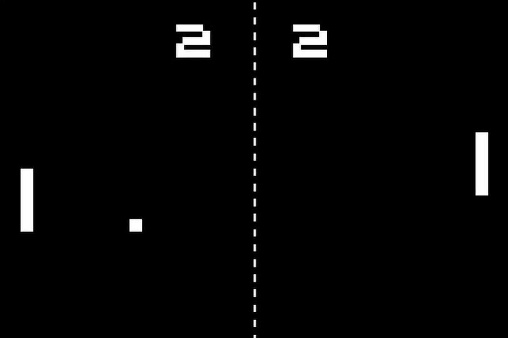

# Pong

  

## Difficulté du jeu  :

- rebond sur les 4 murs
    - quatre direction X,Y , -X,Y , X,-Y , -X, -Y
- rebond sur les pads
- détection quand on est passer les pad
- quand on a laisser passer la balle :
    - elle va au centre
    - et retourne vers vous

---

## UI

- ligne vertical
- score

## Feature

- son
- effet

---

## son impact mur perdu

[Impact Body Heavy.wav](Impact_Body_Heavy.wav)  

